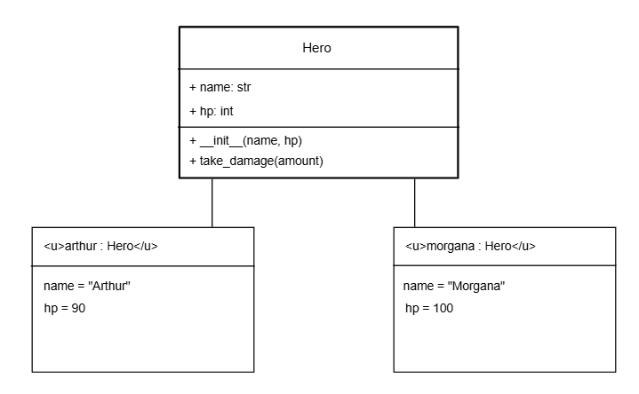

# CS3-CodeToDiagram-Comique

# RPG Hero OOP Assignment

## Class & Object Diagrams
This diagram shows the `Hero` class structure at the top, along with the two individual object instances (`arthur` and `morgana`) showing their final memory states after Arthur takes 10 damage.

## Challenge Question
* **Question:** If we had 100 heroes and only Arthur took damage, how many "Hero" boxes would we have in our diagram? How many "Class" boxes?
* **Answer:** We would have 1 class box, but 100 hero boxes. This is due to the class template only being defined once but 1 hero box for each hero because there would be one for every individual hero instance created in memory.
